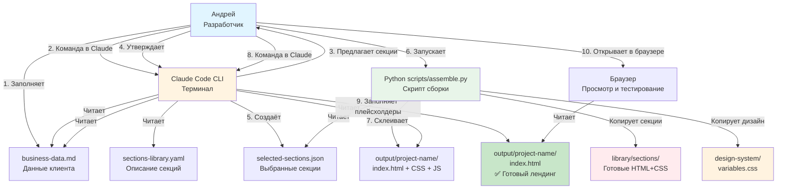

# Architecture: Site Builder — AI-Powered Landing Page Constructor

## 1. Technical Context

**Project Overview:** Site Builder — локальный конструктор лендингов с AI-генерацией контента через Claude Code. Проект решает проблему медленной сборки лендингов (текущий workflow: 3-5 часов → целевой: < 5 минут). "LEGO-подход" — сборка из готовых секций с автоматическим заполнением контента на основе данных бизнеса клиента.

**Key Requirements:**
- Скорость сборки лендинга: < 5 минут (от команды до готовых файлов)
- Качество AI-контента: 80%+ текста не требует редактирования
- Производительность: PageSpeed Insights > 90 баллов
- Адаптивность: mobile/tablet/desktop из коробки
- Универсальность: 10+ типов бизнесов (услуги B2C/B2B, e-commerce)

**Unique Constraints:**
- Терминальная версия Claude Code (НЕ программный API)
- Чистый HTML/CSS/JS без фреймворков (кроме Remix Icon)
- Локальная разработка (файловая система, без базы данных)
- Один разработчик (solo founder Андрей)
- Без жёстких дедлайнов (фокус на качество)

---

## 2. Technology Stack

### Frontend

**Core Technologies:**
- ✅ **HTML5 Semantic Markup** — чистая вёрстка без фреймворков
- ✅ **CSS3 (CSS Variables)** — глобальная дизайн-система с поддержкой светлой/тёмной темы
- ✅ **Vanilla JavaScript ES6+** — минимальная интерактивность (бургер-меню, модальные окна, слайдеры)
- ✅ **Remix Icon 4.x** — 2800+ open-source иконок (Apache License 2.0)

**Design System:**
- **Color Format:** HSL (для совместимости) + опционально OKLCH (для будущих улучшений)
- **Typography:** Гибкая система шрифтов (Inter/Roboto/Montserrat — Google Fonts), базовый размер 16px, шкала 12px → 48px
- **Spacing System:** 4px базовая единица, шкала 4px → 240px (делимое на 4)
- **Breakpoints:** mobile (320px), tablet (768px), desktop (1024px), wide (1440px)

**Justification:**
- ✅ **Без фреймворков:** Максимальная производительность (PageSpeed 90+), нет зависимостей, легко копировать код в Tilda (блок T123)
- ✅ **CSS Variables:** Решает главную проблему Tilda — можно глобально изменять стили через одну переменную
- ✅ **Semantic HTML:** SEO-friendly, accessibility, чистый код для клиентов
- ✅ **Гибкая типографика:** Несколько вариантов шрифтов (Inter/Roboto/Montserrat) для разных типов бизнеса, все с отличной читабельностью и поддержкой кириллицы

### AI Integration

**Claude Code CLI (Терминальная версия):**
- **Роль:** Генерация контента для лендингов (заголовки, описания, отзывы, FAQ)
- **Input:** `business-data.md` (Markdown с данными клиента)
- **Output:** Заполненный `index.html` (плейсхолдеры заменены на контент)
- **Workflow:** Команды в чате (НЕ программный API)

**AI-генерация контента:**
```javascript
// Placeholder syntax in HTML
{{hero.title}}               // Main heading
{{hero.subtitle}}            // Subheading
{{features.item1.title}}     // Feature title
{{features.item1.text}}      // Feature description
{{contacts.phone}}           // Phone from business-data.md
{{testimonials.review1}}     // AI-generated review
{{faq.question1}}            // AI-generated FAQ
```

**Justification:**
- ✅ **Claude Code CLI:** Доступен бесплатно, отличное качество текстов, понимает контекст бизнеса
- ✅ **Markdown для данных:** Удобно редактировать вручную, читаемый формат
- ✅ **Плейсхолдеры:** Явное разделение структуры (HTML) и контента (данные)

### Automation Scripts

**Python 3.8+ (scripts/assemble.py):**
- **Роль:** Автоматическая сборка лендинга из выбранных секций
- **Input:** `selected-sections.json` (список выбранных секций)
- **Output:** Готовый проект в `/output/{project-name}/` (HTML + CSS + JS + assets)

**Script Functions:**
1. Читает `selected-sections.json`
2. Копирует секции из `/library/sections/{section-id}/`
3. Склеивает HTML секций в `index.html`
4. Собирает CSS секций в `css/sections.css`
5. Копирует `design-system/variables.css`
6. Создаёт структуру папок

**Justification:**
- ✅ **Python:** Простой, понятный, встроенный в macOS, минимум зависимостей
- ✅ **JSON для выбора секций:** Удобен для парсинга Python-скриптом
- ✅ **YAML для описания секций:** Удобен для чтения Claude Code и человеком

### File Formats

| Формат | Файл | Назначение | Кто читает |
|--------|------|------------|------------|
| **Markdown** | `business-data.md` | Данные бизнеса клиента | Claude Code, человек |
| **YAML** | `sections-library.yaml` | Описание всех секций | Claude Code |
| **JSON** | `selected-sections.json` | Выбранные секции для сборки | Python-скрипт |
| **CSS** | `variables.css` | Глобальная дизайн-система | Браузер |
| **HTML** | `{section-id}.html` | Секции с плейсхолдерами | Python-скрипт, браузер |

**Justification:**
- ✅ **Markdown:** Удобно заполнять вручную, читаемый формат, поддержка форматирования
- ✅ **YAML:** Удобен для описания структурированных данных (секции с метаданными)
- ✅ **JSON:** Лучший формат для Python-парсинга, компактный, без лишнего синтаксиса

### Infrastructure

**Hosting:**
- ✅ **НЕ требуется** — выходные файлы копируются в Tilda (блок T123) или на любой хостинг вручную
- ✅ **Локальная разработка** — открытие `index.html` напрямую в браузере
- ✅ **Опционально:** Vercel/Netlify для демо или передачи клиенту

**Version Control:**
- ✅ **Git** — версионирование кода, секций, дизайн-системы
- ✅ **GitHub** — хранение репозитория, backup
- ✅ **Branching Strategy:** `main` (стабильная версия) + `feature/{section-name}` для новых секций

**Justification:**
- ✅ **Без хостинга на MVP:** Упрощает разработку, нет затрат, фокус на функционале
- ✅ **Git:** Версионирование секций (можно откатить изменения), совместная работа в будущем
- ✅ **Feature branches:** Изоляция изменений, безопасное тестирование новых секций

---

## 3. System Architecture

### High-Level Architecture Diagram



**Data Flow (4 этапа работы):**

**Этап 1: Планирование и выбор секций**
1. Пользователь заполняет `business-data.md` (тип бизнеса, услуги, контакты)
2. Команда Claude: *"Предложи секции для лендинга"*
3. Claude читает `business-data.md` + `sections-library.yaml`
4. Claude анализирует тип бизнеса → предлагает релевантные секции
5. Пользователь корректирует/утверждает список
6. **Результат:** `selected-sections.json`

**Этап 2: Сборка структуры лендинга**
1. Команда: *"Собери структуру лендинга"*
2. Claude запускает `python scripts/assemble.py`
3. Скрипт копирует секции из `/library/sections/` в `/output/{project-name}/`
4. Склеивает HTML, собирает CSS, подключает дизайн-систему
5. **Результат:** Готовый "каркас" с плейсхолдерами `{{hero.title}}`

**Этап 3: Генерация контента**
1. Команда: *"Заполни лендинг контентом"*
2. Claude читает `business-data.md` + `index.html`
3. Заполняет плейсхолдеры:
   - **Есть в business-data.md** → вставляет как есть (телефон, цены, УТП)
   - **Нет в business-data.md** → генерирует сам (заголовки, описания, отзывы, FAQ)
4. **Результат:** Полностью заполненный `index.html`

**Этап 4: Тестирование и доработка**
1. Открытие `index.html` в браузере
2. Проверка адаптивности, контента, форм, ссылок
3. Команды для правок: *"Измени заголовок Hero на ..."*
4. **Результат:** Готовый лендинг для клиента

---

## 4. Key Design Decisions

### 4.1 Design System Architecture (Based on Design References)

**Цветовая система (HSL формат)**

Основана на материале `/dox/The Easy Way to Pick UI Colors/`:

```css
/* Root Variables — Dark Theme (Default) */
:root {
  /* Background Colors (Lightness: 0% → 10%) */
  --bg-dark: hsl(0, 0%, 0%);      /* Darkest background */
  --bg: hsl(0, 0%, 5%);            /* Base background */
  --bg-light: hsl(0, 0%, 10%);    /* Elevated elements (cards) */

  /* Text Colors (Lightness: 60% → 100%) */
  --text: hsl(0, 0%, 90%);         /* Main text (not 100% — too harsh) */
  --text-muted: hsl(0, 0%, 60%);   /* Secondary text */

  /* Brand Colors (Branding identity) */
  --primary: hsl(220, 90%, 56%);   /* Buttons, links, CTA */
  --secondary: hsl(280, 60%, 60%); /* Secondary actions */
  --accent: hsl(340, 82%, 52%);    /* Highlights, notifications */

  /* Semantic Colors (State feedback) */
  --success: hsl(142, 71%, 45%);   /* Green — success messages */
  --warning: hsl(38, 92%, 50%);    /* Yellow — warnings */
  --error: hsl(4, 90%, 58%);       /* Red — errors */

  /* UI Elements */
  --border: hsl(0, 0%, 20%);       /* Borders, dividers */
  --shadow: rgba(0, 0, 0, 0.3);    /* Box shadows */
}

/* Light Theme (переключение через класс .light-theme) */
.light-theme {
  /* Вычитаем lightness из 100 для инверсии */
  --bg-dark: hsl(0, 0%, 100%);     /* 100 - 0 = 100 */
  --bg: hsl(0, 0%, 95%);           /* 100 - 5 = 95 */
  --bg-light: hsl(0, 0%, 90%);     /* 100 - 10 = 90 */

  --text: hsl(0, 0%, 10%);         /* 100 - 90 = 10 */
  --text-muted: hsl(0, 0%, 40%);   /* 100 - 60 = 40 */

  /* Brand colors остаются такими же */
  --primary: hsl(220, 90%, 56%);
  --secondary: hsl(280, 60%, 60%);
  --accent: hsl(340, 82%, 52%);

  --border: hsl(0, 0%, 80%);       /* 100 - 20 = 80 */
  --shadow: rgba(0, 0, 0, 0.1);    /* Lighter shadow */
}
```

**Why HSL (not HEX/RGB):**
- ✅ **Читаемость:** `hsl(220, 90%, 56%)` понятнее чем `#3B82F6`
- ✅ **Тёмная/светлая тема:** Вычитание `L` из 100 даёт идеальную инверсию
- ✅ **Вариации:** Легко создать светлее/темнее (меняем `L` на ±10%)
- ✅ **Доступность:** Легко проверить контраст (менять `L` до достижения WCAG AA)

**OKLCH (опционально для будущего):**
```css
/* OKLCH — более перцептивно-равномерный формат */
:root {
  --primary: oklch(0.6 0.15 250);  /* L: 0-1, C: 0-0.4, H: 0-360 */
}
```
- ✅ **Преимущества:** Более естественные градации светлоты, лучше для анимаций
- ❌ **Поддержка:** Safari 15.4+, Chrome 111+, Firefox 113+ (почти везде)
- 📝 **Решение:** Использовать HSL для MVP, OKLCH добавить позже как опцию

---

**Типографическая система**

Основана на материале `/dox/The 80% of UI Design - Typography/`:

```css
/* Typography Variables */
:root {
  /* Font Family — Flexible Typography System */
  /* Option 1: Inter (default) — нейтральный, современный, универсальный */
  --font-base: "Inter", -apple-system, BlinkMacSystemFont, "Segoe UI", sans-serif;

  /* Option 2: Roboto — Google's Material Design, технологичный */
  /* --font-base: "Roboto", -apple-system, BlinkMacSystemFont, "Segoe UI", sans-serif; */

  /* Option 3: Montserrat — геометрический, элегантный, для премиум-брендов */
  /* --font-base: "Montserrat", -apple-system, BlinkMacSystemFont, "Segoe UI", sans-serif; */

  /* Option 4: Open Sans — дружелюбный, читабельный, для услуг B2C */
  /* --font-base: "Open Sans", -apple-system, BlinkMacSystemFont, "Segoe UI", sans-serif; */

  /* Option 5: Poppins — современный, геометрический, для стартапов/SaaS */
  /* --font-base: "Poppins", -apple-system, BlinkMacSystemFont, "Segoe UI", sans-serif; */

  /* Font Sizes (базовый размер 16px) */
  --text-xs: 0.75rem;    /* 12px — мелкий текст, метки */
  --text-sm: 0.875rem;   /* 14px — подписи, второстепенный текст */
  --text-base: 1rem;     /* 16px — основной текст */
  --text-lg: 1.125rem;   /* 18px — крупный текст */
  --text-xl: 1.25rem;    /* 20px — подзаголовки */
  --text-2xl: 1.5rem;    /* 24px — H3 */
  --text-3xl: 2rem;      /* 32px — H2 */
  --text-4xl: 3rem;      /* 48px — H1 */

  /* Font Weights */
  --font-regular: 400;   /* Основной текст */
  --font-medium: 500;    /* Подзаголовки, выделение */
  --font-bold: 700;      /* Заголовки, кнопки */

  /* Line Heights (обратно пропорционально размеру) */
  --leading-tight: 1.2;  /* Заголовки */
  --leading-normal: 1.5; /* Основной текст */
  --leading-relaxed: 1.8; /* Мелкий текст */
}
```

**Ключевые принципы (из видео):**
1. ✅ **Минимум размеров:** 99% UI использует 3 размера (14px, 16px, 18px) + заголовки
2. ✅ **Вес + цвет:** Влияние веса и цвета на восприятие размера огромное — не нужно менять `font-size` для выделения
3. ✅ **Line-height:** Меньший текст → больший `line-height` (читабельность), больший `line-height` = встроенный `margin-top`
4. ✅ **Иерархия:** Заголовок — 100% lightness + bold, второстепенное — 60% lightness + regular

**Пример использования:**
```css
h1 {
  font-size: var(--text-4xl);    /* 48px */
  font-weight: var(--font-bold);  /* 700 */
  color: var(--text);             /* 90% lightness */
  line-height: var(--leading-tight); /* 1.2 */
}

p {
  font-size: var(--text-base);   /* 16px */
  font-weight: var(--font-regular); /* 400 */
  color: var(--text-muted);       /* 60% lightness */
  line-height: var(--leading-normal); /* 1.5 */
}
```

**Выбор шрифта для разных типов бизнеса:**

| Шрифт | Характер | Лучше всего для | Weights | Кириллица |
|-------|----------|-----------------|---------|-----------|
| **Inter** | Нейтральный, современный, универсальный | Все типы бизнеса (default), технологичные компании, стартапы | 400, 500, 700 | ✅ Отлично |
| **Roboto** | Технологичный, профессиональный, чёткий | IT-компании, SaaS, технологичные услуги, корпоративные сайты | 400, 500, 700 | ✅ Отлично |
| **Montserrat** | Геометрический, элегантный, премиальный | Премиум-услуги (юридические, консалтинг), модные бренды, агентства | 400, 500, 700 | ✅ Хорошо |
| **Open Sans** | Дружелюбный, тёплый, доступный | Услуги B2C (салоны красоты, ремонт), медицина, образование, НКО | 400, 600, 700 | ✅ Отлично |
| **Poppins** | Современный, дружелюбный, молодёжный | Стартапы, креативные агентства, e-commerce, мобильные приложения | 400, 500, 700 | ✅ Хорошо |

**Рекомендации по выбору:**
1. ✅ **Сомневаешься?** Используй **Inter** (универсальный, подходит 90% проектов)
2. ✅ **Технологичный бизнес?** Roboto (ассоциация с Google, Material Design)
3. ✅ **Премиум-сегмент?** Montserrat (элегантность, статусность)
4. ✅ **Тёплый, человечный бренд?** Open Sans (дружелюбие, доступность)
5. ✅ **Молодой, креативный проект?** Poppins (современность, энергичность)

**Технические характеристики:**

| Метрика | Inter | Roboto | Montserrat | Open Sans | Poppins |
|---------|-------|--------|------------|-----------|---------|
| **Размер файла (WOFF2)** | ~50KB | ~45KB | ~48KB | ~42KB | ~52KB |
| **Google Fonts популярность** | Топ-20 | Топ-3 | Топ-10 | Топ-5 | Топ-15 |
| **X-height** | Высокая | Высокая | Средняя | Высокая | Высокая |
| **Читабельность мелкого текста** | ⭐⭐⭐⭐⭐ | ⭐⭐⭐⭐⭐ | ⭐⭐⭐⭐ | ⭐⭐⭐⭐⭐ | ⭐⭐⭐⭐ |
| **Кириллица (качество)** | ⭐⭐⭐⭐⭐ | ⭐⭐⭐⭐⭐ | ⭐⭐⭐⭐ | ⭐⭐⭐⭐⭐ | ⭐⭐⭐⭐ |

**Подключение через Google Fonts:**
```html
<!-- Inter (default) -->
<link rel="preconnect" href="https://fonts.googleapis.com">
<link rel="preconnect" href="https://fonts.gstatic.com" crossorigin>
<link href="https://fonts.googleapis.com/css2?family=Inter:wght@400;500;700&display=swap" rel="stylesheet">

<!-- Roboto -->
<link href="https://fonts.googleapis.com/css2?family=Roboto:wght@400;500;700&display=swap" rel="stylesheet">

<!-- Montserrat -->
<link href="https://fonts.googleapis.com/css2?family=Montserrat:wght@400;500;700&display=swap" rel="stylesheet">

<!-- Open Sans -->
<link href="https://fonts.googleapis.com/css2?family=Open+Sans:wght@400;600;700&display=swap" rel="stylesheet">

<!-- Poppins -->
<link href="https://fonts.googleapis.com/css2?family=Poppins:wght@400;500;700&display=swap" rel="stylesheet">
```

**Justification:**
- ✅ **Гибкость:** 5 вариантов шрифтов покрывают 95% типов бизнеса
- ✅ **Google Fonts:** Бесплатно, CDN, кешируется браузерами, отличная производительность
- ✅ **Кириллица:** Все шрифты отлично поддерживают русский язык
- ✅ **Один переключатель:** Меняем одну переменную `--font-base` → весь сайт с новым шрифтом
- ✅ **Weights:** Все шрифты имеют 400 (regular), 500/600 (medium), 700 (bold) — достаточно для иерархии

---

**Spacing система**

Основана на материале `/dox/The Easy Way to Design Top Tier Websites/`:

```css
/* Spacing Scale (4px base unit) */
:root {
  --space-1: 0.25rem;   /* 4px */
  --space-2: 0.5rem;    /* 8px */
  --space-3: 0.75rem;   /* 12px */
  --space-4: 1rem;      /* 16px */
  --space-5: 1.25rem;   /* 20px */
  --space-6: 1.5rem;    /* 24px */
  --space-7: 1.75rem;   /* 28px */
  --space-8: 2rem;      /* 32px */
  --space-10: 2.5rem;   /* 40px */
  --space-12: 3rem;     /* 48px */
  --space-15: 3.75rem;  /* 60px */
  --space-20: 5rem;     /* 80px */
  --space-25: 6.25rem;  /* 100px */
  --space-40: 10rem;    /* 160px */
  --space-60: 15rem;    /* 240px */
}
```

**Ключевые принципы (из видео):**
1. ✅ **Начинай с большого:** Spacing 40px → убирай до комфортного (метод из видео)
2. ✅ **Группировка:** Закон близости — элементы ближе = одна группа (20px между группами, 12px внутри группы)
3. ✅ **Система ≠ правило:** Система помогает быстро выбрать значение, но spacing зависит от контекста
4. ✅ **REM единицы:** Адаптация к системным настройкам пользователя (16px = 1rem)

**Пример использования:**
```css
.hero-section {
  padding: var(--space-40) var(--space-8); /* 160px top/bottom, 32px left/right */
}

.feature-card {
  gap: var(--space-3); /* 12px между иконкой и текстом */
  margin-bottom: var(--space-8); /* 32px между карточками */
}

.section-group {
  gap: var(--space-20); /* 80px между секциями */
}
```

---

**UI-элементы**

```css
/* Border Radius */
:root {
  --radius-sm: 0.25rem;  /* 4px — кнопки, инпуты */
  --radius-md: 0.5rem;   /* 8px — карточки */
  --radius-lg: 0.75rem;  /* 12px — модальные окна */
  --radius-xl: 1rem;     /* 16px — крупные блоки */
  --radius-full: 9999px; /* Круглые элементы (аватары, бейджи) */
}

/* Box Shadows */
:root {
  --shadow-sm: 0 1px 2px rgba(0, 0, 0, 0.1);
  --shadow-md: 0 4px 6px rgba(0, 0, 0, 0.1);
  --shadow-lg: 0 10px 15px rgba(0, 0, 0, 0.1);
  --shadow-xl: 0 20px 25px rgba(0, 0, 0, 0.1);
}

/* Transitions */
:root {
  --transition-fast: 150ms ease-in-out;
  --transition-base: 250ms ease-in-out;
  --transition-slow: 350ms ease-in-out;
}
```

**Принцип реалистичных теней (из видео `/dox/The Easy Way to Pick UI Colors/`):**
```css
/* Короткая тёмная тень + длинная светлая тень */
box-shadow:
  0 1px 3px rgba(0, 0, 0, 0.3),   /* Короткая тёмная */
  0 4px 12px rgba(0, 0, 0, 0.15); /* Длинная светлая */
```

---

**Адаптивность (Mobile-First)**

```css
/* Breakpoints (Mobile-First подход) */
@media (min-width: 768px) {  /* Tablet */
  :root {
    --text-4xl: 3.5rem;  /* 56px на планшетах */
    --space-40: 12rem;   /* 192px на планшетах */
  }
}

@media (min-width: 1024px) { /* Desktop */
  :root {
    --text-4xl: 4rem;    /* 64px на десктопе */
    --space-40: 15rem;   /* 240px на десктопе */
  }
}

@media (min-width: 1440px) { /* Wide Desktop */
  :root {
    --text-4xl: 4.5rem;  /* 72px на широких экранах */
  }
}
```

**Responsive Containers:**
```css
.container {
  width: 100%;
  max-width: 1280px; /* Desktop max-width */
  margin: 0 auto;
  padding: 0 var(--space-4); /* 16px на mobile */
}

@media (min-width: 768px) {
  .container {
    padding: 0 var(--space-8); /* 32px на tablet */
  }
}
```

---

### 4.2 Component Library Structure (Библиотека секций)

**Организация файлов:**

```
library/
├── design-system/
│   ├── variables.css        # CSS-переменные (цвета, типографика, spacing)
│   ├── reset.css            # Normalize стили (сброс браузерных стилей)
│   └── utilities.css        # Утилитарные классы (.text-center, .flex, .hidden-mobile)
│
└── sections/
    ├── header-1/
    │   ├── header-1.html    # HTML с плейсхолдерами {{nav.item1}}
    │   ├── header-1.css     # Изолированные стили (используя CSS-переменные)
    │   └── header-1.js      # JavaScript для бургер-меню (опционально)
    │
    ├── hero-1/
    │   ├── hero-1.html      # {{hero.title}}, {{hero.subtitle}}
    │   └── hero-1.css
    │
    ├── features-3col/
    │   ├── features-3col.html  # {{features.item1.icon}}, {{features.item1.title}}
    │   └── features-3col.css
    │
    └── footer-1/
        ├── footer-1.html    # {{contacts.phone}}, {{contacts.email}}
        └── footer-1.css
```

**Пример секции (hero-1):**

`library/sections/hero-1/hero-1.html`:
```html
<section class="hero" id="hero">
  <div class="container">
    <div class="hero__content">
      <h1 class="hero__title">{{hero.title}}</h1>
      <p class="hero__subtitle">{{hero.subtitle}}</p>
      <div class="hero__actions">
        <a href="{{hero.cta_link}}" class="btn btn--primary">{{hero.cta_text}}</a>
        <a href="#about" class="btn btn--secondary">{{hero.secondary_cta}}</a>
      </div>
    </div>
  </div>
</section>
```

`library/sections/hero-1/hero-1.css`:
```css
/* Hero Section — Centralized with CTA */
.hero {
  background: var(--bg);
  padding: var(--space-40) 0;
  text-align: center;
}

.hero__title {
  font-size: var(--text-4xl);
  font-weight: var(--font-bold);
  color: var(--text);
  line-height: var(--leading-tight);
  margin-bottom: var(--space-6);
}

.hero__subtitle {
  font-size: var(--text-lg);
  color: var(--text-muted);
  line-height: var(--leading-normal);
  max-width: 600px;
  margin: 0 auto var(--space-8);
}

.hero__actions {
  display: flex;
  gap: var(--space-4);
  justify-content: center;
  flex-wrap: wrap;
}

@media (max-width: 768px) {
  .hero {
    padding: var(--space-20) 0;
  }

  .hero__title {
    font-size: var(--text-3xl); /* 32px на mobile */
  }
}
```

**Ключевые принципы секций:**
1. ✅ **Изоляция:** Каждая секция — независимый модуль (можно использовать отдельно)
2. ✅ **CSS-переменные:** Все стили через `var(--text)`, `var(--space-8)` (легко кастомизировать)
3. ✅ **Плейсхолдеры:** Явное указание что заполняется (`{{hero.title}}`)
4. ✅ **BEM naming:** `.hero__title`, `.hero__actions` (читаемость, избегание конфликтов)
5. ✅ **Адаптивность:** Media queries встроены (mobile-first)

---

### 4.3 JavaScript Interactivity (Vanilla JS)

**Минимальный набор интерактивности:**

`library/sections/header-1/header-1.js`:
```javascript
/**
 * Burger menu toggle for mobile navigation
 * Usage: Include this script in sections that need mobile menu
 */
const burgerMenu = () => {
  const burger = document.querySelector('.header__burger');
  const nav = document.querySelector('.header__nav');
  const body = document.body;

  if (!burger || !nav) return;

  burger.addEventListener('click', () => {
    // Toggle active state
    burger.classList.toggle('is-active');
    nav.classList.toggle('is-open');
    body.classList.toggle('no-scroll'); // Prevent scrolling when menu open
  });

  // Close menu on link click
  const navLinks = nav.querySelectorAll('a');
  navLinks.forEach(link => {
    link.addEventListener('click', () => {
      burger.classList.remove('is-active');
      nav.classList.remove('is-open');
      body.classList.remove('no-scroll');
    });
  });

  // Close menu on ESC key
  document.addEventListener('keydown', (e) => {
    if (e.key === 'Escape' && nav.classList.contains('is-open')) {
      burger.classList.remove('is-active');
      nav.classList.remove('is-open');
      body.classList.remove('no-scroll');
    }
  });
};

// Initialize on DOM ready
document.addEventListener('DOMContentLoaded', burgerMenu);
```

**Другие интерактивные элементы (опционально):**
- **Modal windows:** Открытие/закрытие модальных окон (формы, галерея)
- **Smooth scroll:** Плавная прокрутка к якорям (`<a href="#about">`)
- **Form validation:** Базовая валидация полей (HTML5 + JS)
- **Sliders:** Карусель отзывов или портфолио (опционально, можно без библиотек)

**Justification:**
- ✅ **Vanilla JS:** Нет зависимостей, маленький размер (< 10KB), легко понять и модифицировать
- ✅ **Progressive Enhancement:** Сайт работает без JS (accessibility), JS только улучшает UX
- ✅ **ES6+ синтаксис:** Современный, читаемый код (стрелочные функции, `const`/`let`, шаблонные строки)

---

### 4.4 Placeholder System & AI Content Generation

**Синтаксис плейсхолдеров:**

```
{{category.field}}         # Простое значение
{{category.item1.field}}   # Вложенный объект (для списков)
```

**Категории плейсхолдеров:**

| Категория | Примеры | Источник данных |
|-----------|---------|-----------------|
| **hero** | `{{hero.title}}`, `{{hero.subtitle}}` | AI-генерация (если нет в business-data.md) |
| **features** | `{{features.item1.title}}`, `{{features.item1.icon}}` | AI-генерация + Remix Icon class |
| **pricing** | `{{pricing.service1}}`, `{{pricing.price1}}` | business-data.md (обязательно) |
| **contacts** | `{{contacts.phone}}`, `{{contacts.email}}` | business-data.md (обязательно) |
| **testimonials** | `{{testimonials.review1}}` | AI-генерация |
| **faq** | `{{faq.question1}}`, `{{faq.answer1}}` | AI-генерация |
| **nav** | `{{nav.item1}}`, `{{nav.item2}}` | Названия секций (auto) |

**Пример business-data.md:**

```markdown
# Данные бизнеса: Ремонт стиральных машин

## Основная информация
- **Тип бизнеса:** Услуги B2C (ремонт техники)
- **Название:** "Мастер Плюс"
- **Город:** Москва (все районы)

## УТП (Уникальные торговые предложения)
1. Выезд мастера за 30 минут
2. Гарантия 1 год на все работы
3. Оплата после ремонта (только за результат)

## Услуги и цены
- Диагностика — Бесплатно
- Замена подшипника — от 3500 руб
- Ремонт платы управления — от 2500 руб
- Замена ТЭНа — от 2000 руб

## Контакты
- **Телефон:** +7 (495) 123-45-67
- **Email:** info@masterplus.ru
- **Адрес:** Москва, ул. Примерная, 123 (офис, не показывать на сайте)
- **График работы:** Ежедневно с 8:00 до 22:00

## Соцсети
- **Telegram:** @masterplus_moscow
- **WhatsApp:** +7 (495) 123-45-67
- **VK:** vk.com/masterplus
```

**Логика AI-генерации (Claude Code):**

```
1. Прочитать business-data.md
2. Прочитать index.html (найти плейсхолдеры)
3. Для каждого плейсхолдера:

   IF плейсхолдер в business-data.md:
     → Вставить как есть (contacts.phone → "+7 (495) 123-45-67")

   ELSE:
     → Сгенерировать контент на основе:
        - Тип бизнеса (услуги B2C — ремонт техники)
        - Город (Москва)
        - УТП (выезд 30 минут, гарантия 1 год)

   Примеры генерации:
   - {{hero.title}} → "Ремонт стиральных машин в Москве за 30 минут"
   - {{hero.subtitle}} → "Выезд мастера бесплатно. Гарантия 1 год. Оплата после ремонта."
   - {{testimonials.review1}} → "Мастер приехал через 40 минут, починил стиралку за час. Отличная работа!" — Мария К.
   - {{faq.question1}} → "Сколько стоит выезд мастера?" — "Выезд бесплатный при заказе ремонта"
```

**Ключевые принципы генерации:**
1. ✅ **Контекст:** Учитывать тип бизнеса (салон красоты ≠ ремонт техники)
2. ✅ **Локализация:** Город, регион (Москва vs Санкт-Петербург)
3. ✅ **УТП в заголовках:** Главные преимущества в Hero-секции
4. ✅ **SEO-friendly:** H1 с ключевыми словами ("ремонт стиральных машин в Москве")
5. ✅ **Реалистичность:** Отзывы с именами, FAQ с типичными вопросами

---

### 4.5 Python Assembly Script Architecture

**Структура скрипта `scripts/assemble.py`:**

```python
#!/usr/bin/env python3
"""
Site Builder — Landing Page Assembly Script
Reads selected-sections.json and assembles a complete landing page
"""

import json
import os
import shutil
from pathlib import Path

# Configuration
PROJECT_ROOT = Path(__file__).parent.parent
LIBRARY_DIR = PROJECT_ROOT / "library"
OUTPUT_DIR = PROJECT_ROOT / "output"
TEMPLATES_DIR = PROJECT_ROOT / "templates"

def load_selected_sections(config_path):
    """Load selected sections from JSON file"""
    with open(config_path, 'r', encoding='utf-8') as f:
        return json.load(f)

def create_project_structure(project_name):
    """Create output directory structure"""
    project_dir = OUTPUT_DIR / project_name
    dirs = ['css', 'js', 'assets/images']

    for dir_path in dirs:
        (project_dir / dir_path).mkdir(parents=True, exist_ok=True)

    return project_dir

def copy_design_system(project_dir):
    """Copy design system CSS files"""
    design_system = LIBRARY_DIR / "design-system"

    shutil.copy(design_system / "variables.css", project_dir / "css")
    shutil.copy(design_system / "reset.css", project_dir / "css")
    shutil.copy(design_system / "utilities.css", project_dir / "css")

def assemble_html(sections, project_dir):
    """Concatenate HTML sections into index.html"""
    html_parts = [
        '<!DOCTYPE html>',
        '<html lang="ru">',
        '<head>',
        '  <meta charset="UTF-8">',
        '  <meta name="viewport" content="width=device-width, initial-scale=1.0">',
        '  <title>{{meta.title}}</title>',
        '  <link rel="stylesheet" href="css/variables.css">',
        '  <link rel="stylesheet" href="css/reset.css">',
        '  <link rel="stylesheet" href="css/sections.css">',
        '  <link rel="stylesheet" href="css/utilities.css">',
        '</head>',
        '<body>',
    ]

    # Add sections HTML
    for section in sections:
        section_html = LIBRARY_DIR / "sections" / section['id'] / f"{section['id']}.html"
        with open(section_html, 'r', encoding='utf-8') as f:
            html_parts.append(f.read())

    html_parts.extend(['</body>', '</html>'])

    # Write to index.html
    output_file = project_dir / "index.html"
    with open(output_file, 'w', encoding='utf-8') as f:
        f.write('\n'.join(html_parts))

def assemble_css(sections, project_dir):
    """Concatenate CSS sections into sections.css"""
    css_parts = []

    for section in sections:
        section_css = LIBRARY_DIR / "sections" / section['id'] / f"{section['id']}.css"
        with open(section_css, 'r', encoding='utf-8') as f:
            css_parts.append(f"/* {section['id']} */")
            css_parts.append(f.read())
            css_parts.append("")  # Empty line separator

    # Write to sections.css
    output_file = project_dir / "css" / "sections.css"
    with open(output_file, 'w', encoding='utf-8') as f:
        f.write('\n'.join(css_parts))

def copy_javascript(sections, project_dir):
    """Copy JavaScript files (if exist)"""
    js_parts = []

    for section in sections:
        section_js = LIBRARY_DIR / "sections" / section['id'] / f"{section['id']}.js"
        if section_js.exists():
            with open(section_js, 'r', encoding='utf-8') as f:
                js_parts.append(f"/* {section['id']} */")
                js_parts.append(f.read())
                js_parts.append("")

    if js_parts:
        output_file = project_dir / "js" / "main.js"
        with open(output_file, 'w', encoding='utf-8') as f:
            f.write('\n'.join(js_parts))

def main():
    # Load configuration
    config_path = TEMPLATES_DIR / "selected-sections.json"
    config = load_selected_sections(config_path)

    project_name = config['project_name']
    sections = sorted(config['sections'], key=lambda x: x['order'])

    print(f"🚀 Assembling landing page: {project_name}")
    print(f"📦 Sections: {', '.join([s['id'] for s in sections])}")

    # Create project structure
    project_dir = create_project_structure(project_name)
    print(f"✅ Created project directory: {project_dir}")

    # Copy design system
    copy_design_system(project_dir)
    print(f"✅ Copied design system")

    # Assemble HTML
    assemble_html(sections, project_dir)
    print(f"✅ Assembled index.html")

    # Assemble CSS
    assemble_css(sections, project_dir)
    print(f"✅ Assembled sections.css")

    # Copy JavaScript
    copy_javascript(sections, project_dir)
    print(f"✅ Copied JavaScript (if exists)")

    print(f"\n🎉 Done! Landing page ready at: {project_dir}/index.html")
    print(f"⏱️  Time: < 5 seconds")

if __name__ == "__main__":
    main()
```

**Функции скрипта:**
1. ✅ **Читает `selected-sections.json`** → список секций для сборки
2. ✅ **Создаёт структуру папок** → `/output/{project-name}/`
3. ✅ **Копирует дизайн-систему** → `variables.css`, `reset.css`, `utilities.css`
4. ✅ **Склеивает HTML** → все секции в один `index.html`
5. ✅ **Склеивает CSS** → все секции в один `sections.css`
6. ✅ **Копирует JavaScript** → если есть `.js` файлы в секциях
7. ✅ **Логирование** → понятный вывод прогресса

**Пример `selected-sections.json`:**
```json
{
  "project_name": "washing-machine-repair",
  "sections": [
    {"id": "header-1", "order": 1},
    {"id": "hero-2", "order": 2},
    {"id": "features-3col", "order": 3},
    {"id": "pricing", "order": 4},
    {"id": "contact-form", "order": 5},
    {"id": "footer-1", "order": 6}
  ]
}
```

**Justification:**
- ✅ **Python:** Простой, читаемый, встроенный в macOS, минимум зависимостей
- ✅ **Pathlib:** Удобная работа с путями (кроссплатформенность)
- ✅ **Encoding UTF-8:** Обязательно для кириллицы (критично для проекта)
- ✅ **Логирование:** Понятный вывод → легко дебажить
- ✅ **Быстрота:** < 5 секунд на сборку (цель достигнута)

---

### 4.6 YAML Sections Library Format

**Файл `templates/sections-library.yaml`:**

```yaml
# Site Builder — Sections Library
# Description of all available sections for Claude Code
# Format: YAML (human-readable, easy to parse)

sections:
  # ========================================
  # P0 Sections (Обязательные, 5-7 шт)
  # ========================================

  - id: "header-1"
    name: "Header — Логотип + Меню + Телефон + Кнопка"
    category: "header"
    description: "Классический header с sticky, бургер-меню для mobile, кнопка CTA"
    best_for:
      - "Услуги B2C (телефонные обращения)"
      - "E-commerce (корзина, поиск)"
      - "Лендинги с несколькими секциями"
    features:
      - "Sticky header (фиксированный при прокрутке)"
      - "Responsive бургер-меню (mobile)"
      - "Кнопка CTA справа"
      - "Телефон кликабельный (tel:)"
    placeholders:
      - "{{logo.text}}"
      - "{{nav.item1}}, {{nav.item2}}, {{nav.item3}}"
      - "{{contacts.phone}}"
      - "{{header.cta_text}}"

  - id: "hero-1"
    name: "Hero — Центрированный с формой"
    category: "hero"
    description: "H1, подзаголовок, форма захвата email (лид-магнит)"
    best_for:
      - "Лид-магниты (скачать гайд, получить консультацию)"
      - "Подписка на рассылку"
      - "SaaS (регистрация)"
    features:
      - "Центрированный текст"
      - "Форма email + CTA"
      - "Фон можно заменить на изображение/градиент"
    placeholders:
      - "{{hero.title}}"
      - "{{hero.subtitle}}"
      - "{{hero.cta_text}}"

  - id: "hero-2"
    name: "Hero — Текст слева + Изображение справа"
    category: "hero"
    description: "H1, подзаголовок, 2 CTA-кнопки, изображение справа"
    best_for:
      - "Услуги B2C/B2B"
      - "Товары (показать фото продукта)"
      - "Агентства (показать портфолио)"
    features:
      - "Двухколоночный layout (50/50)"
      - "2 CTA-кнопки (primary + secondary)"
      - "Адаптивный (стакается на mobile)"
    placeholders:
      - "{{hero.title}}"
      - "{{hero.subtitle}}"
      - "{{hero.cta_text}}"
      - "{{hero.secondary_cta}}"
      - "{{hero.image_url}}"

  - id: "features-2col"
    name: "Features — 2 колонки с иконками"
    category: "features"
    description: "Преимущества/услуги в 2 колонки (4-6 пунктов)"
    best_for:
      - "Небольшое количество услуг (4-6)"
      - "УТП (уникальные торговые предложения)"
      - "Портфолио (категории работ)"
    features:
      - "Remix Icon для иконок"
      - "Заголовок + описание"
      - "Адаптивный (стакается на mobile)"
    placeholders:
      - "{{features.section_title}}"
      - "{{features.item1.icon}}"  # Remix Icon class (ri-shield-check-line)
      - "{{features.item1.title}}"
      - "{{features.item1.text}}"

  - id: "features-3col"
    name: "Features — 3 колонки с иконками"
    category: "features"
    description: "Преимущества/услуги в 3 колонки (6-9 пунктов)"
    best_for:
      - "Много услуг (6-9)"
      - "Процесс работы (шаги)"
      - "Характеристики продукта"
    features:
      - "Remix Icon для иконок"
      - "Числовые бейджи (01, 02, 03...)"
      - "Адаптивный (2 col на tablet, 1 col на mobile)"
    placeholders:
      - "{{features.section_title}}"
      - "{{features.item1.icon}}"
      - "{{features.item1.title}}"
      - "{{features.item1.text}}"

  - id: "cta-simple"
    name: "CTA — Простой призыв к действию"
    category: "cta"
    description: "Заголовок, текст, одна кнопка"
    best_for:
      - "Переход к следующей секции"
      - "Скачать файл"
      - "Записаться на консультацию"
    features:
      - "Центрированный текст"
      - "Одна CTA-кнопка"
      - "Контрастный фон"
    placeholders:
      - "{{cta.title}}"
      - "{{cta.text}}"
      - "{{cta.button_text}}"

  - id: "footer-1"
    name: "Footer — Логотип + Меню + Контакты + Соцсети"
    category: "footer"
    description: "Классический footer с 4 колонками"
    best_for:
      - "Все типы лендингов"
      - "Многостраничные сайты"
    features:
      - "4 колонки (О компании, Меню, Контакты, Соцсети)"
      - "Copyright внизу"
      - "Иконки соцсетей (Remix Icon)"
    placeholders:
      - "{{footer.about}}"
      - "{{nav.item1}}, {{nav.item2}}"
      - "{{contacts.phone}}, {{contacts.email}}, {{contacts.address}}"
      - "{{social.vk}}, {{social.telegram}}, {{social.whatsapp}}"

  # ========================================
  # P1 Sections (Важные, 8+ шт)
  # ========================================

  - id: "pricing"
    name: "Pricing — Прайс-листы (3 колонки)"
    category: "pricing"
    description: "3 тарифа с ценами и списком функций"
    best_for:
      - "SaaS (подписки)"
      - "Услуги с пакетами (базовый, стандарт, премиум)"
    features:
      - "3 карточки (Basic, Pro, Premium)"
      - "Highlight на популярном тарифе"
      - "Чек-листы функций"
    placeholders:
      - "{{pricing.plan1.name}}, {{pricing.plan1.price}}"
      - "{{pricing.plan1.feature1}}, {{pricing.plan1.feature2}}"

  - id: "contact-form"
    name: "Contact Form — Форма связи"
    category: "contact"
    description: "Форма с полями: Имя, Телефон, Email, Сообщение"
    best_for:
      - "Все типы лендингов"
      - "Обратная связь"
    features:
      - "HTML5 валидация"
      - "JavaScript-валидация (опционально)"
      - "Action: mailto: или PHP (настраивается)"
    placeholders:
      - "{{form.title}}"
      - "{{contacts.phone}}"  # Куда отправлять

  - id: "testimonials"
    name: "Testimonials — Отзывы клиентов"
    category: "testimonials"
    description: "3 отзыва с фото, именем, рейтингом"
    best_for:
      - "Услуги (доверие клиентов)"
      - "E-commerce (отзывы о товаре)"
    features:
      - "3 карточки отзывов"
      - "Звёзды рейтинга (5/5)"
      - "Фото клиента (опционально)"
    placeholders:
      - "{{testimonials.review1.text}}"
      - "{{testimonials.review1.name}}"
      - "{{testimonials.review1.rating}}"

  - id: "faq"
    name: "FAQ — Часто задаваемые вопросы"
    category: "faq"
    description: "Аккордеон с 5-7 вопросами"
    best_for:
      - "Все типы лендингов"
      - "Снижение количества звонков с базовыми вопросами"
    features:
      - "JavaScript аккордеон (expand/collapse)"
      - "5-7 вопросов"
    placeholders:
      - "{{faq.question1}}, {{faq.answer1}}"

  # ========================================
  # Metadata
  # ========================================

metadata:
  version: "1.0"
  last_updated: "2025-01-24"
  total_sections: 10
  min_sections_for_landing: 5
  recommended_sections_order:
    - "header-1"
    - "hero-1 или hero-2"
    - "features-2col или features-3col"
    - "pricing или contact-form"
    - "cta-simple"
    - "footer-1"
```

**Justification:**
- ✅ **YAML:** Читаемый формат (для Claude и человека), поддержка комментариев, списки и вложенность
- ✅ **Структура:** Категории (P0/P1), метаданные (best_for, features)
- ✅ **Плейсхолдеры:** Явное указание что заполнять
- ✅ **Расширяемость:** Легко добавить новые секции (просто добавить блок в YAML)

---

## 5. Architecture Decision Records (ADR)

### ADR-001: Color Format (HSL vs OKLCH)

**Status:** Accepted
**Date:** 2025-01-24
**Deciders:** Андрей + Claude Full-Stack Architect

**Context:**
- Нужна цветовая система с поддержкой светлой/тёмной темы
- Дизайн-референс `/dox/The Easy Way to Pick UI Colors/` рекомендует HSL и OKLCH
- OKLCH перцептивно-равномерный (более естественные градации), но новый стандарт
- Поддержка браузеров OKLCH: Safari 15.4+, Chrome 111+, Firefox 113+ (≈90% пользователей)

**Decision:**
Использовать **HSL для MVP**, с опциональной поддержкой OKLCH в будущем.

**Rationale:**
1. **Совместимость:** HSL поддерживается всеми браузерами (100%)
2. **Простота:** Вычитание `L` из 100 для инверсии темы (принцип из видео)
3. **Читаемость:** `hsl(220, 90%, 56%)` понятнее чем `#3B82F6`
4. **Будущее:** OKLCH можно добавить позже как прогрессивное улучшение

**Consequences:**

**Positive:**
- ✅ Работает во всех браузерах
- ✅ Простое переключение светлой/тёмной темы
- ✅ Легко создавать вариации (менять `L` на ±10%)

**Negative:**
- ❌ Градации светлоты не идеально перцептивные (тёмные цвета теряют насыщенность)
- ❌ OKLCH даст более естественные анимации цветов

**Alternatives Considered:**

| Alternative | Pros | Cons | Why Not Chosen |
|-------------|------|------|----------------|
| **OKLCH only** | Перцептивно-равномерный, лучше для анимаций | Не поддерживается в старых браузерах | 10% пользователей не увидят стили |
| **HEX** | Компактный формат | Нечитаемый, сложно создавать вариации | Невозможно переключать тему без дубликатов |
| **RGB** | Универсальный | Нечитаемый, нет понятия "lightness" | Сложно создавать оттенки |

**Review Date:** 2026-01-24 (когда OKLCH поддержка > 95%)

---

### ADR-002: JavaScript Framework (Vanilla vs React/Vue)

**Status:** Accepted
**Date:** 2025-01-24
**Deciders:** Андрей + Claude Full-Stack Architect

**Context:**
- Нужна минимальная интерактивность (бургер-меню, модальные окна, слайдеры)
- Цель: PageSpeed > 90 баллов (производительность критична)
- Выходные файлы копируются в Tilda (блок T123) → нужен чистый код без зависимостей
- Один разработчик (Андрей) → нет необходимости в сложной архитектуре

**Decision:**
Использовать **Vanilla JavaScript ES6+** (без фреймворков).

**Rationale:**
1. **Производительность:** Нет overhead фреймворка (React bundle ≈ 42KB gzipped)
2. **Простота:** Минимальная интерактивность не требует React/Vue
3. **Совместимость с Tilda:** Чистый JS легко вставить в блок T123
4. **Размер бандла:** < 10KB JS (цель достигнута)
5. **Progressive Enhancement:** Сайт работает без JS (accessibility)

**Consequences:**

**Positive:**
- ✅ Максимальная производительность (PageSpeed 90+)
- ✅ Нет зависимостей (не нужен npm, webpack, vite)
- ✅ Чистый код для клиентов (легко понять и модифицировать)
- ✅ Легко копировать в Tilda

**Negative:**
- ❌ Нет реактивности (придётся вручную манипулировать DOM)
- ❌ Сложнее масштабировать на большое приложение

**Alternatives Considered:**

| Alternative | Pros | Cons | Why Not Chosen |
|-------------|------|------|----------------|
| **React** | Реактивность, богатая экосистема, популярность | Bundle 42KB+, нужен build step, сложно в Tilda | Overhead не оправдан для лендингов |
| **Vue** | Легче React, реактивность | Bundle 32KB+, нужен build step | Всё ещё слишком сложно для MVP |
| **Alpine.js** | Очень лёгкий (15KB), реактивность | Ещё одна зависимость, нужен CDN | Не нужна реактивность для лендингов |

**Review Date:** 2025-07-24 (если появятся сложные интерактивные элементы)

---

### ADR-003: CSS Methodology (BEM vs Tailwind vs CSS Modules)

**Status:** Accepted
**Date:** 2025-01-24
**Deciders:** Андрей + Claude Full-Stack Architect

**Context:**
- Нужна методология для структурирования CSS
- Секции должны быть изолированы (избегать конфликтов классов)
- Цель: читаемый, масштабируемый CSS
- Дизайн-референс `/dox/The Easy Way to Design Top Tier Websites/` рекомендует дизайн-систему

**Decision:**
Использовать **Component-First архитектуру** с **BEM (Block Element Modifier)** + **CSS Variables** для дизайн-системы.

**Философия: Component-First над Utility-First**

Проект следует **Component-First** подходу, где каждая секция (header, hero, footer) самодостаточна с собственным CSS-файлом.

**Utility Classes используются ТОЛЬКО для:**
1. ✅ **Universal layout** — `.container` (max-width, responsive padding)
2. ✅ **Accessibility** — `.sr-only`, `.skip-to-main` (WCAG 2.1 compliance)
3. ✅ **Responsive visibility** — `.hidden-mobile`, `.show-mobile`, `.hidden-tablet`, `.hidden-desktop`
4. ✅ **Modal helpers** — `.no-scroll` (disable body scroll)

**НЕ используются утилиты для:**
- ❌ `display: flex/grid/block` — стили в компонентном CSS
- ❌ `justify-*`, `items-*`, `gap-*` — стили в компонентном CSS
- ❌ `text-align` — стили в компонентном CSS
- ❌ `position` (relative, absolute, etc.) — стили в компонентном CSS

**Rationale:**
1. **Изоляция:** BEM предотвращает конфликты (`.hero__title` vs `.features__title`)
2. **Читаемость:** Явное указание структуры (блок, элемент, модификатор)
3. **CSS Variables:** Глобальные стили через `var(--text)`, `var(--space-8)`
4. **Простота:** Нет build step, работает напрямую в браузере
5. **Совместимость:** BEM + CSS Variables поддерживаются всеми современными браузерами
6. **Портируемость:** Секции самодостаточны — копируешь HTML+CSS, и всё работает (важно для Tilda)
7. **Чистый HTML:** Минимум классов, семантическая разметка, без "class soup"

**Consequences:**

**Positive:**
- ✅ Избегание конфликтов CSS (каждая секция изолирована)
- ✅ Читаемый код (`.hero__title`, `.hero__subtitle`)
- ✅ Легко кастомизировать (меняем CSS-переменные)
- ✅ Нет build step

**Negative:**
- ❌ Длинные имена классов (`.features__item-description`)
- ❌ Нужно следовать соглашению (может нарушиться при ручном редактировании)

**Alternatives Considered:**

| Alternative | Pros | Cons | Why Not Chosen |
|-------------|------|------|----------------|
| **Tailwind CSS** | Утилитарные классы, быстрая разработка | Нужен build step, длинный HTML, сложно в Tilda | Overhead не оправдан, нужен PostCSS |
| **CSS Modules** | Автоматическая изоляция, нет конфликтов | Нужен build step (webpack, vite) | Слишком сложно для простых лендингов |
| **Inline Styles** | Нет конфликтов, изоляция | Нет переиспользования, плохая производительность | Невозможно использовать медиа-запросы |

**Review Date:** Не требуется (BEM — устоявшаяся методология)

---

### ADR-004: Иконки (Remix Icon vs Font Awesome vs SVG Sprites)

**Status:** Accepted
**Date:** 2025-01-24
**Deciders:** Андрей + Claude Full-Stack Architect

**Context:**
- Нужны иконки для секций (Features, Footer, Header)
- PRD указывает Remix Icon (2800+ иконок, open-source, Apache License 2.0)
- Цель: производительность + удобство использования

**Decision:**
Использовать **Remix Icon 4.x** (веб-шрифт + SVG).

**Rationale:**
1. **Open-Source:** Apache License 2.0 (можно использовать коммерчески)
2. **Большая библиотека:** 2800+ иконок (покрывает 99% потребностей)
3. **Лёгкий вес:** ≈ 50KB (сжатый веб-шрифт)
4. **Простота использования:** `<i class="ri-phone-line"></i>`
5. **SVG опция:** Можно использовать SVG-спрайты для лучшей производительности

**Consequences:**

**Positive:**
- ✅ Огромная библиотека иконок (не нужно искать в разных источниках)
- ✅ Простое использование (HTML-класс)
- ✅ Open-source (нет лицензионных проблем)
- ✅ Легко кастомизировать (CSS `color`, `font-size`)

**Negative:**
- ❌ Веб-шрифт = дополнительный HTTP-запрос
- ❌ Нельзя анимировать отдельные части иконки (в отличие от inline SVG)

**Alternatives Considered:**

| Alternative | Pros | Cons | Why Not Chosen |
|-------------|------|------|----------------|
| **Font Awesome** | Популярный, 2000+ иконок | Pro версия платная, веб-шрифт 90KB | Remix Icon легче и бесплатнее |
| **SVG Sprites** | Лучшая производительность, анимации | Нужно вручную собирать спрайты | Сложнее в использовании для MVP |
| **Inline SVG** | Максимальный контроль, анимации | Раздувает HTML, неудобно вставлять | Плохая переиспользуемость |

**Review Date:** 2026-01-24 (если появятся проблемы с производительностью — мигрировать на SVG-спрайты)

---

## 6. Security Measures

**Критические меры безопасности:**

- [ ] **Transport Security**
  - HTTPS only (при деплое на хостинг)
  - Secure cookies: `httpOnly`, `secure` (для форм с сохранением данных)

- [ ] **Input Validation**
  - HTML5 валидация форм (`required`, `type="email"`, `pattern`)
  - JavaScript-валидация (дополнительная проверка перед отправкой)
  - Санитизация HTML-контента (если пользователи могут вставлять текст)

- [ ] **Forms Security**
  - CSRF protection (для PHP/Node.js обработчиков форм)
  - Rate limiting (защита от спама форм)
  - Honeypot field (скрытое поле для ботов)

- [ ] **Content Security**
  - CSP headers: `Content-Security-Policy: default-src 'self'; script-src 'self' 'unsafe-inline';`
  - Sanitize user-generated content (если есть комментарии/отзывы)

**Justification:**
- ✅ **HTTPS:** Стандарт для всех сайтов (Google понижает HTTP в поисковой выдаче)
- ✅ **Валидация форм:** Предотвращение отправки некорректных данных
- ✅ **CSP:** Защита от XSS-атак (вредоносный JavaScript)

**Note:** Безопасность не критична для MVP (статические лендинги без базы данных), но важна при добавлении обработки форм.

---

## 7. Performance Optimization

**Frontend Performance Targets:**

| Metric | Target | Measurement |
|--------|--------|-------------|
| **PageSpeed Insights** | > 90 баллов | Google PageSpeed Insights |
| **Time to First Byte (TTFB)** | < 200ms | Chrome DevTools Network |
| **First Contentful Paint (FCP)** | < 1.5s | Lighthouse |
| **Largest Contentful Paint (LCP)** | < 2.5s | Lighthouse |
| **Cumulative Layout Shift (CLS)** | < 0.1 | Lighthouse |
| **Bundle size** | < 200KB (initial load) | webpack-bundle-analyzer |

**Optimization Strategies:**

- [ ] **HTML Optimization**
  - Semantic markup (Header, Nav, Section, Article, Footer)
  - Minimal DOM depth (избегать глубокой вложенности)
  - Inline critical CSS (для первого экрана)

- [ ] **CSS Optimization**
  - Minification (удаление пробелов, комментариев)
  - Remove unused CSS (PurgeCSS для продакшена)
  - CSS-переменные (вместо дублирования значений)

- [ ] **JavaScript Optimization**
  - Minification (Terser)
  - Defer non-critical scripts (`<script defer>`)
  - ES6 modules (динамический импорт для больших модулей)

- [ ] **Image Optimization**
  - WebP format (60-80% меньше размер vs JPEG/PNG)
  - Lazy loading (`loading="lazy"` для изображений вне первого экрана)
  - Responsive images (`<picture>` + `srcset` для разных экранов)
  - Compression (TinyPNG, ImageOptim)

- [ ] **Font Optimization**
  - Google Fonts с `&display=swap` (избегание FOIT — Flash Of Invisible Text)
  - Subset fonts (загружать только кириллицу + латиницу)
  - Preconnect: `<link rel="preconnect" href="https://fonts.googleapis.com">`

**Justification:**
- ✅ **PageSpeed 90+:** Лучший UX, выше конверсия, лучшее SEO
- ✅ **WebP:** Современный формат (поддержка 95%+ браузеров)
- ✅ **Lazy loading:** Экономия трафика, быстрая загрузка первого экрана

---

## 8. Development Workflow

### Local Development

```bash
# 1. Заполнить данные клиента
vim templates/business-data.md

# 2. Команда Claude: "Предложи секции для лендинга"
# Claude создаёт templates/selected-sections.json

# 3. Запустить скрипт сборки
python3 scripts/assemble.py

# 4. Открыть в браузере (macOS)
open output/project-name/index.html

# 5. Команда Claude: "Заполни лендинг контентом"
# Claude редактирует output/project-name/index.html

# 6. Проверить в браузере
open output/project-name/index.html
```

**Hot Reload (опционально):**
```bash
# Установить Live Server (VS Code Extension)
# или использовать Python HTTP server
cd output/project-name
python3 -m http.server 8000

# Открыть http://localhost:8000
```

### Git Workflow

```bash
# Создание feature branch для новой секции
git checkout -b feature/testimonials-section

# Разработка секции
# library/sections/testimonials/testimonials.html
# library/sections/testimonials/testimonials.css

# Commit
git add library/sections/testimonials/
git commit -m "feat: add testimonials section with 3-column layout"

# Merge в main
git checkout main
git merge feature/testimonials-section
git branch -d feature/testimonials-section

# Push
git push origin main
```

**Branching Strategy:**
- `main` — стабильная версия (готовые секции)
- `feature/{section-name}` — разработка новой секции
- `fix/{issue}` — исправление багов

**Commit Message Format:**
```
feat: add testimonials section
fix: burger menu not closing on mobile
refactor: optimize CSS variables
chore: update sections-library.yaml
```

---

## 9. Testing Strategy

**Ручное тестирование (основное):**

- [ ] **Визуальная проверка**
  - Открыть в Chrome, Firefox, Safari
  - Проверить на mobile (DevTools Device Toolbar)
  - Проверить адаптивность (resize окна)

- [ ] **Контент**
  - Все плейсхолдеры заменены на контент
  - Телефоны кликабельны (`tel:`)
  - Email кликабельны (`mailto:`)
  - Соцсети ведут на правильные URL

- [ ] **Формы**
  - Поля ввода работают
  - Валидация срабатывает (required, email)
  - Кнопка отправки работает (mailto: или PHP)

- [ ] **Интерактивность**
  - Бургер-меню открывается/закрывается
  - Smooth scroll к якорям работает
  - Модальные окна открываются/закрываются (если есть)

- [ ] **Производительность**
  - PageSpeed Insights > 90
  - Lighthouse (Performance, Accessibility, Best Practices, SEO)

**Автоматизированные тесты (опционально, не для MVP):**
```bash
# HTML валидация
html5validator output/project-name/index.html

# Lighthouse CI
lighthouse https://example.com --output html --output-path report.html

# Проверка доступности (a11y)
pa11y https://example.com
```

**Justification:**
- ✅ **Ручное тестирование:** Достаточно для MVP (один разработчик)
- ✅ **PageSpeed Insights:** Критичная метрика (SEO, UX)
- ✅ **Автотесты позже:** Когда библиотека секций вырастет до 15+ шт

---

## 10. Documentation

**Обязательные документы:**

1. **README.md** — обзор проекта, инструкции по установке
2. **ARCHITECTURE.md** — этот документ (техническая архитектура)
3. **PRD.md** — требования к продукту (уже создан)
4. **sections-library.yaml** — описание всех секций (для Claude)
5. **business-data.md** — шаблон для данных клиента

**Опциональные документы (для будущего):**
- **CONTRIBUTING.md** — как добавлять новые секции
- **CHANGELOG.md** — история изменений
- **DESIGN-SYSTEM.md** — подробное описание дизайн-системы

---

## 11. Future Enhancements (Post-MVP)

**P1 Features (после MVP):**
- Дополнительные секции (P1: About, Pricing, Testimonials, FAQ)
- Генерация изображений (Unsplash API или плейсхолдеры)
- Вариации дизайн-системы (светлая/тёмная тема, цветовые схемы)
- CLI-интерфейс (`sitebuilder create washing-machine-repair`)

**P2 Features (долгосрочные):**
- Интеграция с Tilda API (автоматическая загрузка кода)
- Поддержка многостраничных сайтов
- A/B тестирование (разные варианты Hero-секций)
- Analytics интеграция (Google Analytics, Yandex Metrika)
- CMS для клиента (редактирование контента без кода)

---

## Status: ✅ Ready for PLANNING Phase

**Ключевые архитектурные решения:**
1. ✅ **Дизайн-система:** HSL цвета, Inter шрифт, 4px spacing (на основе дизайн-референсов)
2. ✅ **Технологии:** Чистый HTML/CSS/JS, Remix Icon, Python-скрипт сборки
3. ✅ **AI-интеграция:** Claude Code CLI для генерации контента
4. ✅ **Производительность:** Цель PageSpeed > 90 (без фреймворков)
5. ✅ **Workflow:** 4 этапа (планирование → сборка → генерация → тестирование)

**Следующие шаги:**
1. ✅ Андрей утверждает архитектуру
2. → Переход к PLANNING.md (разбивка на спринты и задачи)
3. → Создание TASKS.md (детальные задачи для Claude Code)

**Вопросы?** Спроси, если что-то непонятно или нужны уточнения!
