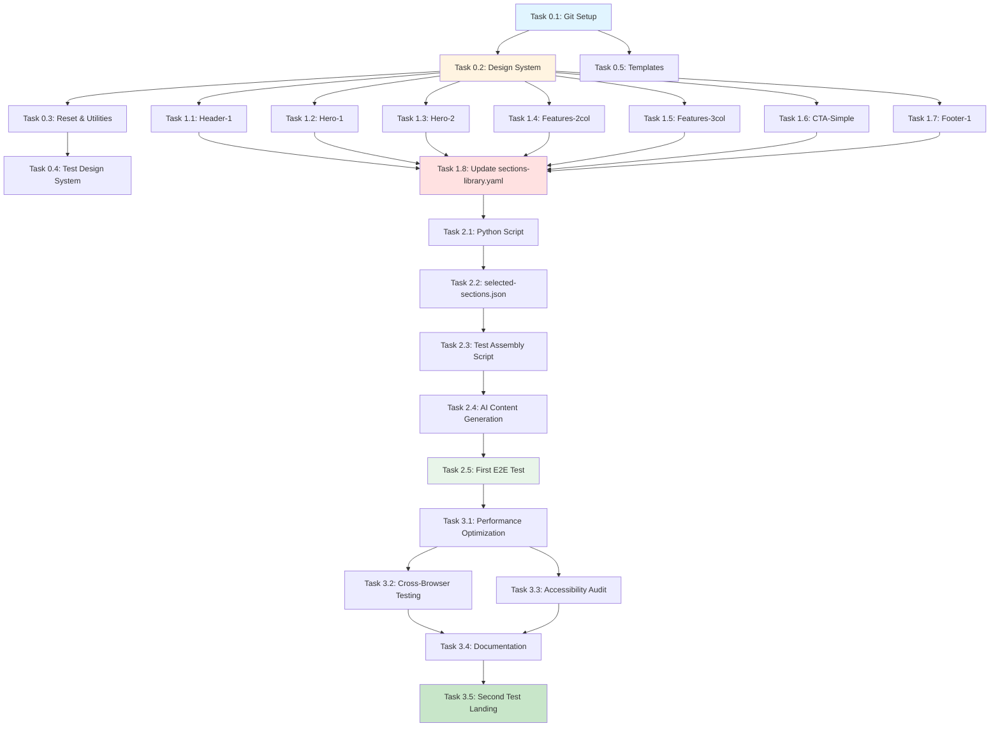

# Development Roadmap: Site Builder — AI-Powered Landing Page Constructor

## Project Timeline

**Total Duration:** 4-6 недель (без жёстких дедлайнов, фокус на качество)
**Team Size:** 1 Full-Stack Developer (Андрей) + Claude Code CLI
**Release Strategy:** MVP (P0 секции) → Расширение (P1 секции) → Дополнительные фичи (P2)
**Target Launch Date:** Гибкий, без жёстких дедлайнов

**Временные затраты:**
- MVP: ~60-80 часов разработки (3-4 недели при 20 часов/неделю)
- Buffer time: +20% на debugging и непредвиденное (~15-20 часов)
- **Итого:** 75-100 часов на MVP

---

## Sprint Overview

| Sprint | Duration | Focus Area | Key Deliverables |
|--------|----------|------------|------------------|
| **Sprint 0** | 2-3 дня | Setup & Design System | Git, дизайн-система (variables.css), утилиты, reset.css |
| **Sprint 1** | 5-7 дней | P0 Секции (обязательные) | 5-7 базовых секций (Header, Hero, Features, CTA, Footer) |
| **Sprint 2** | 3-4 дня | Automation & AI | Python-скрипт сборки, sections-library.yaml, business-data.md, AI-генерация |
| **Sprint 3** | 2-3 дня | Testing & Polish | Тестирование, оптимизация, документация, первый лендинг |

**Общая продолжительность MVP:** 12-17 дней разработки (при работе 4-5 часов/день)

---

## Sprint 0: Foundation & Design System

**Timeline:** 2-3 дня (10-15 часов)
**Goal:** Настроить Git, создать дизайн-систему, базовую структуру проекта

### User Stories

#### Story 0.1: Project Setup
```
As a developer
I want to initialize the project repository with proper structure
So that I can start developing sections efficiently

Acceptance Criteria:
- [ ] Git repository initialized with .gitignore
- [ ] Folder structure created (/library, /templates, /scripts, /output, /dox)
- [ ] README.md с описанием проекта и инструкциями
- [ ] Git branching strategy определена (main + feature/*)
- [ ] First commit: "feat: initialize project structure"
```

#### Story 0.2: Design System Creation
```
As a developer
I want a comprehensive design system with CSS variables
So that all sections use consistent styling

Acceptance Criteria:
- [ ] variables.css создан с цветовой системой (HSL формат)
- [ ] Типографическая система с 5 вариантами шрифтов (Inter default)
- [ ] Spacing система (4px base unit, шкала 4px → 240px)
- [ ] UI-элементы (border-radius, box-shadow, transitions)
- [ ] Breakpoints для адаптивности (768px, 1024px, 1440px)
- [ ] reset.css для сброса браузерных стилей
- [ ] utilities.css для утилитарных классов
```

#### Story 0.3: Design System Testing
```
As a developer
I want to verify the design system works correctly
So that I can use it confidently in sections

Acceptance Criteria:
- [ ] Создан test.html с примерами всех CSS-переменных
- [ ] Проверены цвета (bg, text, primary, secondary, semantic)
- [ ] Проверены размеры шрифтов (12px → 48px)
- [ ] Проверен spacing (4px → 240px)
- [ ] Проверена адаптивность на mobile/tablet/desktop
- [ ] Тёмная/светлая тема переключается через класс .light-theme
```

### Tasks Breakdown

#### Task 0.1: Initialize Git Repository & Project Structure
**Priority:** P0 (Blocking)
**Estimated Time:** 1 hour
**Dependencies:** None

**Deliverables:**
- Git repository initialized
- Folder structure created
- .gitignore configured (node_modules, .env, output/*, .DS_Store)
- README.md с описанием проекта
- Initial commit

**Technical Details:**
```bash
# Commands
git init
mkdir -p library/{sections,design-system} templates scripts output dox
touch .gitignore README.md
```

**File structure:**
```
/site-builder/
├── library/
│   ├── design-system/
│   └── sections/
├── templates/
├── scripts/
├── output/
├── dox/
├── .gitignore
└── README.md
```

---

#### Task 0.2: Create Design System (variables.css)
**Priority:** P0 (Blocking)
**Estimated Time:** 4 hours
**Dependencies:** Task 0.1

**Deliverables:**
- library/design-system/variables.css
- Цветовая система (HSL формат)
- Типографическая система (5 шрифтов)
- Spacing система
- UI-элементы (radius, shadow, transitions)

**Technical Details:**
- Основано на `/dox/The Easy Way to Pick UI Colors/`
- Основано на `/dox/The 80% of UI Design - Typography/`
- Основано на `/dox/The Easy Way to Design Top Tier Websites/`
- Используем HSL для совместимости (OKLCH позже)
- Шрифт по умолчанию: Inter (Google Fonts)

**Code structure:**
```css
:root {
  /* Colors (HSL) */
  --bg-dark: hsl(0, 0%, 0%);
  --bg: hsl(0, 0%, 5%);
  --text: hsl(0, 0%, 90%);
  --primary: hsl(220, 90%, 56%);

  /* Typography */
  --font-base: "Inter", sans-serif;
  --text-base: 1rem;
  --text-4xl: 3rem;

  /* Spacing */
  --space-4: 1rem;
  --space-8: 2rem;

  /* UI */
  --radius-md: 0.5rem;
  --shadow-md: 0 4px 6px rgba(0,0,0,0.1);
}
```

---

#### Task 0.3: Create Reset & Utilities CSS
**Priority:** P0 (Blocking)
**Estimated Time:** 2 hours
**Dependencies:** Task 0.2

**Deliverables:**
- library/design-system/reset.css
- library/design-system/utilities.css

**Technical Details:**
- reset.css: Normalize браузерные стили (box-sizing, margin, padding)
- utilities.css: Утилитарные классы (.container, .text-center, .flex, .hidden-mobile)

**Code examples:**
```css
/* reset.css */
*, *::before, *::after {
  box-sizing: border-box;
  margin: 0;
  padding: 0;
}

/* utilities.css */
.container {
  width: 100%;
  max-width: 1280px;
  margin: 0 auto;
  padding: 0 var(--space-4);
}

.text-center { text-align: center; }
.flex { display: flex; }
.hidden-mobile { display: none; }
@media (min-width: 768px) {
  .hidden-mobile { display: block; }
}
```

---

#### Task 0.4: Test Design System
**Priority:** P1
**Estimated Time:** 2 hours
**Dependencies:** Task 0.2, Task 0.3

**Deliverables:**
- library/design-system/test.html
- Визуальная проверка всех CSS-переменных

**Technical Details:**
- Создать HTML с примерами цветов, типографики, spacing
- Открыть в браузере (Chrome, Firefox, Safari)
- Проверить адаптивность (DevTools responsive mode)
- Проверить переключение светлой/тёмной темы

---

#### Task 0.5: Create Templates (business-data.md, sections-library.yaml)
**Priority:** P0 (Blocking)
**Estimated Time:** 2 hours
**Dependencies:** Task 0.1

**Deliverables:**
- templates/business-data.md (шаблон для данных клиента)
- templates/sections-library.yaml (описание секций для Claude)

**Technical Details:**
- business-data.md: Markdown-шаблон с примерами заполнения
- sections-library.yaml: Пустой файл (заполним позже, когда создадим секции)

**business-data.md structure:**
```markdown
# Данные бизнеса: [Название]

## Основная информация
- **Тип бизнеса:** [Услуги B2C / B2B / E-commerce]
- **Название:** [Название компании]
- **Город:** [Город]

## УТП (Уникальные торговые предложения)
1. [УТП 1]
2. [УТП 2]
3. [УТП 3]

## Услуги и цены
- [Услуга 1] — [Цена]
- [Услуга 2] — [Цена]

## Контакты
- **Телефон:** +7 (XXX) XXX-XX-XX
- **Email:** info@example.com
- **Адрес:** [Адрес]
- **График работы:** [График]

## Соцсети
- **Telegram:** @username
- **WhatsApp:** +7 (XXX) XXX-XX-XX
- **VK:** vk.com/username
```

---

**Sprint 0 Total:** 11 hours

---

## Sprint 1: P0 Sections (Обязательные секции)

**Timeline:** 5-7 дней (30-40 часов)
**Goal:** Создать 5-7 базовых секций (Header, Hero, Features, CTA, Footer)

### User Stories

#### Story 1.1: Header Section
```
As a developer
I want a responsive header component
So that all landing pages have navigation

Acceptance Criteria:
- [ ] Логотип (текстовый плейсхолдер {{logo.text}})
- [ ] Навигационное меню ({{nav.item1}}, {{nav.item2}}, {{nav.item3}})
- [ ] Телефон кликабельный ({{contacts.phone}} → tel:)
- [ ] Кнопка CTA ({{header.cta_text}})
- [ ] Sticky header (фиксируется при прокрутке)
- [ ] Бургер-меню для mobile (JavaScript)
- [ ] Адаптивность (mobile/tablet/desktop)
```

#### Story 1.2: Hero Sections (2 варианта)
```
As a developer
I want 2 hero section variants
So that I can choose based on landing page type

Acceptance Criteria:
- [ ] Hero-1: Центрированный с формой (email + CTA)
- [ ] Hero-2: Текст слева + изображение справа (2 CTA-кнопки)
- [ ] Плейсхолдеры: {{hero.title}}, {{hero.subtitle}}, {{hero.cta_text}}
- [ ] Адаптивность (mobile: стакается в одну колонку)
- [ ] Фон можно заменить (цвет/градиент/изображение)
```

#### Story 1.3: Features Sections (2 варианта)
```
As a developer
I want features/benefits sections
So that I can showcase product advantages

Acceptance Criteria:
- [ ] Features-2col: 2 колонки (4-6 пунктов)
- [ ] Features-3col: 3 колонки (6-9 пунктов)
- [ ] Remix Icon для иконок ({{features.item1.icon}})
- [ ] Плейсхолдеры: {{features.item1.title}}, {{features.item1.text}}
- [ ] Адаптивность (mobile: 1 col, tablet: 2 col, desktop: 2/3 col)
```

#### Story 1.4: CTA Section
```
As a developer
I want a simple call-to-action section
So that I can drive conversions

Acceptance Criteria:
- [ ] Заголовок ({{cta.title}})
- [ ] Текст ({{cta.text}})
- [ ] Кнопка CTA ({{cta.button_text}})
- [ ] Контрастный фон (выделяется на странице)
- [ ] Центрированный layout
```

#### Story 1.5: Footer Section
```
As a developer
I want a comprehensive footer
So that all landing pages have contact info

Acceptance Criteria:
- [ ] 4 колонки: О компании, Меню, Контакты, Соцсети
- [ ] Плейсхолдеры: {{footer.about}}, {{nav.item1}}, {{contacts.phone}}, {{social.vk}}
- [ ] Иконки соцсетей (Remix Icon)
- [ ] Copyright внизу
- [ ] Адаптивность (mobile: stack в 1 col)
```

### Tasks Breakdown

#### Task 1.1: Create Header-1 Section
**Priority:** P0 (Blocking)
**Estimated Time:** 5 hours
**Dependencies:** Task 0.2 (Design System)

**Deliverables:**
- library/sections/header-1/header-1.html
- library/sections/header-1/header-1.css
- library/sections/header-1/header-1.js (бургер-меню)

**Technical Details:**
- BEM naming: `.header`, `.header__logo`, `.header__nav`
- Sticky header: `position: sticky; top: 0;`
- Бургер-меню: JavaScript toggle класса `.is-open`
- Адаптивность: Media query `@media (max-width: 768px)`

**Placeholders:**
- `{{logo.text}}` — текст логотипа
- `{{nav.item1}}`, `{{nav.item2}}`, `{{nav.item3}}` — пункты меню
- `{{contacts.phone}}` — телефон (tel: ссылка)
- `{{header.cta_text}}` — текст кнопки CTA

**Code comments:** English

---

#### Task 1.2: Create Hero-1 Section (Centered with Form)
**Priority:** P0 (Blocking)
**Estimated Time:** 4 hours
**Dependencies:** Task 0.2

**Deliverables:**
- library/sections/hero-1/hero-1.html
- library/sections/hero-1/hero-1.css

**Technical Details:**
- Центрированный layout: `text-align: center;`
- Форма: Email input + Submit button
- Адаптивность: padding уменьшается на mobile

**Placeholders:**
- `{{hero.title}}` — H1 заголовок
- `{{hero.subtitle}}` — подзаголовок
- `{{hero.cta_text}}` — текст кнопки
- `{{hero.cta_link}}` — ссылка кнопки (по умолчанию #contact)

---

#### Task 1.3: Create Hero-2 Section (Text + Image)
**Priority:** P0 (Blocking)
**Estimated Time:** 4 hours
**Dependencies:** Task 0.2

**Deliverables:**
- library/sections/hero-2/hero-2.html
- library/sections/hero-2/hero-2.css

**Technical Details:**
- 2-колоночный layout: CSS Grid (`grid-template-columns: 1fr 1fr;`)
- 2 CTA-кнопки: Primary + Secondary
- Адаптивность: stack на mobile (1 col)

**Placeholders:**
- `{{hero.title}}` — H1 заголовок
- `{{hero.subtitle}}` — подзаголовок
- `{{hero.cta_text}}` — текст primary кнопки
- `{{hero.secondary_cta}}` — текст secondary кнопки
- `{{hero.image_url}}` — URL изображения

---

#### Task 1.4: Create Features-2col Section
**Priority:** P0 (Blocking)
**Estimated Time:** 5 hours
**Dependencies:** Task 0.2

**Deliverables:**
- library/sections/features-2col/features-2col.html
- library/sections/features-2col/features-2col.css

**Technical Details:**
- 2-колоночный grid: `grid-template-columns: repeat(2, 1fr);`
- Remix Icon: `<i class="ri-shield-check-line"></i>`
- Адаптивность: 1 col на mobile, 2 col на tablet+

**Placeholders:**
- `{{features.section_title}}` — заголовок секции (H2)
- `{{features.item1.icon}}` — Remix Icon класс (например: ri-shield-check-line)
- `{{features.item1.title}}` — заголовок преимущества
- `{{features.item1.text}}` — описание преимущества
- Всего 4 пункта (item1 → item4)

---

#### Task 1.5: Create Features-3col Section
**Priority:** P0 (Blocking)
**Estimated Time:** 5 hours
**Dependencies:** Task 0.2

**Deliverables:**
- library/sections/features-3col/features-3col.html
- library/sections/features-3col/features-3col.css

**Technical Details:**
- 3-колоночный grid: `grid-template-columns: repeat(3, 1fr);`
- Адаптивность: 1 col на mobile, 2 col на tablet, 3 col на desktop

**Placeholders:**
- Аналогично features-2col, но 6 пунктов (item1 → item6)

---

#### Task 1.6: Create CTA-Simple Section
**Priority:** P0 (Blocking)
**Estimated Time:** 3 hours
**Dependencies:** Task 0.2

**Deliverables:**
- library/sections/cta-simple/cta-simple.html
- library/sections/cta-simple/cta-simple.css

**Technical Details:**
- Центрированный layout
- Контрастный фон (использует `var(--primary)`)
- Padding: `var(--space-40)`

**Placeholders:**
- `{{cta.title}}` — заголовок (H2)
- `{{cta.text}}` — текст
- `{{cta.button_text}}` — текст кнопки

---

#### Task 1.7: Create Footer-1 Section
**Priority:** P0 (Blocking)
**Estimated Time:** 6 hours
**Dependencies:** Task 0.2

**Deliverables:**
- library/sections/footer-1/footer-1.html
- library/sections/footer-1/footer-1.css

**Technical Details:**
- 4-колоночный grid: `grid-template-columns: repeat(4, 1fr);`
- Адаптивность: stack на mobile
- Иконки соцсетей: Remix Icon (`ri-telegram-line`, `ri-whatsapp-line`, `ri-vk-line`)

**Placeholders:**
- `{{footer.about}}` — текст о компании
- `{{nav.item1}}`, `{{nav.item2}}`, `{{nav.item3}}` — меню
- `{{contacts.phone}}`, `{{contacts.email}}`, `{{contacts.address}}` — контакты
- `{{social.vk}}`, `{{social.telegram}}`, `{{social.whatsapp}}` — ссылки на соцсети
- `{{footer.copyright}}` — текст copyright

---

#### Task 1.8: Update sections-library.yaml with P0 Sections
**Priority:** P0 (Blocking)
**Estimated Time:** 2 hours
**Dependencies:** Task 1.1 → 1.7

**Deliverables:**
- templates/sections-library.yaml (заполнен описаниями P0 секций)

**Technical Details:**
- Формат YAML
- Для каждой секции: id, name, category, description, best_for, features, placeholders

**Example:**
```yaml
sections:
  - id: "header-1"
    name: "Header — Логотип + Меню + Телефон + Кнопка"
    category: "header"
    description: "Классический header с sticky, бургер-меню для mobile"
    best_for:
      - "Услуги B2C (телефонные обращения)"
      - "E-commerce"
    features:
      - "Sticky header"
      - "Responsive бургер-меню"
      - "Кнопка CTA"
    placeholders:
      - "{{logo.text}}"
      - "{{nav.item1}}, {{nav.item2}}, {{nav.item3}}"
      - "{{contacts.phone}}"
      - "{{header.cta_text}}"
```

---

**Sprint 1 Total:** 34 hours

---

## Sprint 2: Automation & AI Content Generation

**Timeline:** 3-4 дня (18-24 часов)
**Goal:** Создать Python-скрипт сборки, интегрировать AI-генерацию контента

### User Stories

#### Story 2.1: Python Assembly Script
```
As a developer
I want an automated script to assemble landing pages
So that I can build landing pages in < 5 minutes

Acceptance Criteria:
- [ ] Скрипт читает templates/selected-sections.json
- [ ] Копирует выбранные секции из library/sections/
- [ ] Склеивает HTML секций в output/{project-name}/index.html
- [ ] Собирает CSS секций в output/{project-name}/css/sections.css
- [ ] Копирует design-system CSS в output/{project-name}/css/
- [ ] Копирует JavaScript (если есть) в output/{project-name}/js/
- [ ] Скрипт выполняется < 5 секунд
- [ ] Логирование понятное (какие секции склеены, время)
```

#### Story 2.2: AI Content Generation
```
As a developer
I want Claude Code to generate content for placeholders
So that landing pages have realistic content

Acceptance Criteria:
- [ ] Claude Code читает business-data.md
- [ ] Claude Code читает index.html (находит плейсхолдеры)
- [ ] Плейсхолдеры из business-data.md → вставляются как есть
- [ ] Плейсхолдеры без данных → генерируются Claude (заголовки, отзывы, FAQ)
- [ ] Качество AI-контента: 80%+ не требует редактирования
- [ ] Контент релевантен типу бизнеса (салон красоты ≠ ремонт техники)
```

#### Story 2.3: First Landing Page Assembly
```
As a developer
I want to assemble and fill my first landing page
So that I can validate the entire workflow

Acceptance Criteria:
- [ ] Заполнен business-data.md (пример: ремонт стиральных машин)
- [ ] Claude предложил секции на основе business-data.md
- [ ] selected-sections.json создан
- [ ] Python-скрипт выполнен → каркас лендинга готов
- [ ] Claude заполнил контент → готовый лендинг
- [ ] Лендинг открывается в браузере и выглядит корректно
```

### Tasks Breakdown

#### Task 2.1: Create Python Assembly Script (assemble.py)
**Priority:** P0 (Blocking)
**Estimated Time:** 8 hours
**Dependencies:** Sprint 1 (секции созданы)

**Deliverables:**
- scripts/assemble.py

**Technical Details:**
- Python 3.8+
- Использует `pathlib` для работы с путями
- Encoding UTF-8 (критично для кириллицы!)
- Функции:
  1. `load_selected_sections(config_path)` — читает JSON
  2. `create_project_structure(project_name)` — создаёт папки
  3. `copy_design_system(project_dir)` — копирует CSS
  4. `assemble_html(sections, project_dir)` — склеивает HTML
  5. `assemble_css(sections, project_dir)` — склеивает CSS
  6. `copy_javascript(sections, project_dir)` — копирует JS

**Code structure:**
```python
#!/usr/bin/env python3
import json
import shutil
from pathlib import Path

def load_selected_sections(config_path):
    with open(config_path, 'r', encoding='utf-8') as f:
        return json.load(f)

def assemble_html(sections, project_dir):
    html_parts = [
        '<!DOCTYPE html>',
        '<html lang="ru">',
        '<head>',
        '  <meta charset="UTF-8">',
        '  <title>{{meta.title}}</title>',
        '  <!-- CSS links -->',
        '</head>',
        '<body>',
    ]

    for section in sections:
        section_html = f"library/sections/{section['id']}/{section['id']}.html"
        with open(section_html, 'r', encoding='utf-8') as f:
            html_parts.append(f.read())

    html_parts.extend(['</body>', '</html>'])

    output_file = project_dir / "index.html"
    with open(output_file, 'w', encoding='utf-8') as f:
        f.write('\n'.join(html_parts))
```

**Testing:**
```bash
python3 scripts/assemble.py
# Expected: output/{project-name}/ created with files
```

---

#### Task 2.2: Create selected-sections.json Template
**Priority:** P0 (Blocking)
**Estimated Time:** 1 hour
**Dependencies:** Task 2.1

**Deliverables:**
- templates/selected-sections.json (шаблон)

**Technical Details:**
- JSON формат
- Поля: `project_name`, `sections` (массив объектов с `id`, `order`)

**Example:**
```json
{
  "project_name": "example-project",
  "sections": [
    {"id": "header-1", "order": 1},
    {"id": "hero-2", "order": 2},
    {"id": "features-3col", "order": 3},
    {"id": "cta-simple", "order": 4},
    {"id": "footer-1", "order": 5}
  ]
}
```

---

#### Task 2.3: Test Assembly Script with Mock Data
**Priority:** P0 (Blocking)
**Estimated Time:** 2 hours
**Dependencies:** Task 2.1, Task 2.2

**Deliverables:**
- Протестированный скрипт
- Первый готовый "каркас" лендинга

**Technical Details:**
- Создать тестовый selected-sections.json
- Запустить скрипт
- Проверить вывод в /output/test-project/
- Открыть index.html в браузере
- Визуально проверить структуру (плейсхолдеры видны)

---

#### Task 2.4: AI Content Generation Logic (Claude Code Prompts)
**Priority:** P0 (Blocking)
**Estimated Time:** 6 hours
**Dependencies:** Task 2.3

**Deliverables:**
- Документация для Claude Code (как заполнять плейсхолдеры)
- Тестовый business-data.md (пример: ремонт стиральных машин)

**Technical Details:**
- Создать промпт для Claude:
  ```
  Команда: "Заполни лендинг контентом на основе business-data.md"

  Логика:
  1. Прочитай business-data.md
  2. Прочитай index.html (найди плейсхолдеры {{...}})
  3. Для каждого плейсхолдера:
     - IF данные есть в business-data.md → вставь как есть
     - ELSE → сгенерируй контент на основе типа бизнеса
  4. Замени плейсхолдеры в index.html
  ```

- Создать тестовый business-data.md:
  ```markdown
  # Данные бизнеса: Ремонт стиральных машин

  ## Основная информация
  - Тип бизнеса: Услуги B2C (ремонт техники)
  - Название: "Мастер Плюс"
  - Город: Москва

  ## УТП
  1. Выезд мастера за 30 минут
  2. Гарантия 1 год
  3. Оплата после ремонта

  ## Услуги и цены
  - Диагностика — Бесплатно
  - Замена подшипника — от 3500 руб

  ## Контакты
  - Телефон: +7 (495) 123-45-67
  - Email: info@masterplus.ru
  ```

---

#### Task 2.5: First End-to-End Test (Полный workflow)
**Priority:** P0 (Blocking)
**Estimated Time:** 3 hours
**Dependencies:** Task 2.4

**Deliverables:**
- Первый готовый лендинг (washing-machine-repair)

**Technical Details:**
- Workflow:
  1. Заполнить business-data.md (ремонт стиральных машин)
  2. Команда Claude: "Предложи секции для лендинга"
  3. Claude создаёт selected-sections.json
  4. Запустить `python3 scripts/assemble.py`
  5. Команда Claude: "Заполни лендинг контентом"
  6. Открыть output/washing-machine-repair/index.html в браузере
  7. Проверить визуально (контент, адаптивность)

**Success Criteria:**
- Время от команды до готовых файлов: < 5 минут
- Качество AI-контента: 80%+ не требует редактирования
- Лендинг адаптивен на mobile/tablet/desktop

---

**Sprint 2 Total:** 20 hours

---

## Sprint 3: Testing, Optimization & Documentation

**Timeline:** 2-3 дня (12-18 часов)
**Goal:** Тестирование, оптимизация производительности, документация

### User Stories

#### Story 3.1: Performance Optimization
```
As a developer
I want landing pages to load quickly
So that PageSpeed Insights score > 90

Acceptance Criteria:
- [ ] PageSpeed Insights score > 90 (mobile & desktop)
- [ ] Page load time < 2 seconds
- [ ] Largest Contentful Paint (LCP) < 2.5s
- [ ] First Contentful Paint (FCP) < 1.5s
- [ ] Cumulative Layout Shift (CLS) < 0.1
- [ ] Total bundle size < 200KB (HTML + CSS + JS)
```

#### Story 3.2: Cross-Browser & Device Testing
```
As a developer
I want landing pages to work on all browsers and devices
So that users have consistent experience

Acceptance Criteria:
- [ ] Тестирование на Chrome, Firefox, Safari (последние 2 версии)
- [ ] Тестирование на mobile (iOS Safari, Android Chrome)
- [ ] Тестирование на разных разрешениях (320px, 768px, 1024px, 1440px)
- [ ] Адаптивность работает корректно (нет горизонтальной прокрутки)
- [ ] Формы работают (кнопки, ссылки, tel:, mailto:)
```

#### Story 3.3: Documentation & Handoff
```
As a developer
I want comprehensive documentation
So that I can use the system efficiently in the future

Acceptance Criteria:
- [ ] README.md обновлён (инструкции по использованию)
- [ ] sections-library.yaml содержит описания всех P0 секций
- [ ] business-data.md шаблон заполнен примерами
- [ ] Комментарии в коде на английском
- [ ] Git commits следуют формату (feat:, fix:, refactor:)
```

### Tasks Breakdown

#### Task 3.1: Performance Audit & Optimization
**Priority:** P0 (Blocking)
**Estimated Time:** 6 hours
**Dependencies:** Sprint 2 (лендинг готов)

**Deliverables:**
- Оптимизированные CSS/JS файлы
- PageSpeed Insights report > 90

**Technical Details:**
- Запустить Google PageSpeed Insights
- Оптимизации:
  1. Minify CSS (удалить пробелы, комментарии)
  2. Inline critical CSS (для первого экрана)
  3. Defer non-critical JavaScript
  4. Add `loading="lazy"` для изображений
  5. Optimize Google Fonts loading (`&display=swap`)
  6. Add `preconnect` для Google Fonts

**Testing:**
```bash
# PageSpeed Insights
lighthouse https://example.com --output html --output-path report.html
```

---

#### Task 3.2: Cross-Browser Testing
**Priority:** P1
**Estimated Time:** 4 hours
**Dependencies:** Task 3.1

**Deliverables:**
- Тестовый отчёт (браузеры, устройства)
- Исправления багов (если найдены)

**Technical Details:**
- Browsers: Chrome 130+, Firefox 125+, Safari 17+
- Devices: iPhone 15 (Safari), Samsung Galaxy (Chrome), Desktop (1920x1080)
- Tools: Chrome DevTools Device Toolbar, BrowserStack (опционально)

**Checklist:**
- [ ] Header sticky работает
- [ ] Бургер-меню открывается/закрывается (mobile)
- [ ] Формы работают (tel:, mailto:)
- [ ] Адаптивность (не ломается на разных разрешениях)
- [ ] Шрифты загружаются корректно

---

#### Task 3.3: Accessibility Audit
**Priority:** P2
**Estimated Time:** 3 hours
**Dependencies:** Task 3.1

**Deliverables:**
- Accessibility fixes (ARIA labels, alt texts, keyboard navigation)

**Technical Details:**
- Lighthouse Accessibility audit
- Требования:
  1. Alt texts для изображений
  2. ARIA labels для интерактивных элементов
  3. Keyboard navigation (Tab, Enter, Escape)
  4. Color contrast > 4.5:1 (WCAG AA)

**Tools:**
```bash
# Accessibility testing
lighthouse https://example.com --only-categories=accessibility
```

---

#### Task 3.4: Update Documentation
**Priority:** P1
**Estimated Time:** 4 hours
**Dependencies:** All previous tasks

**Deliverables:**
- README.md обновлён
- Комментарии в коде (English)
- Git history чистый (правильные коммиты)

**README.md structure:**
```markdown
# Site Builder — AI-Powered Landing Page Constructor

## Overview
[Описание проекта]

## Features
- CSS Variables Design System
- 5-7 P0 Sections (Header, Hero, Features, CTA, Footer)
- Python Assembly Script
- AI Content Generation via Claude Code

## Quick Start
1. Fill templates/business-data.md
2. Command Claude: "Предложи секции"
3. Run: python3 scripts/assemble.py
4. Command Claude: "Заполни контентом"
5. Open: output/{project-name}/index.html

## Project Structure
[Описание структуры файлов]

## Workflow (4 Stages)
[Детали 4 этапов]

## Performance
- PageSpeed > 90
- Load time < 2s
- Bundle size < 200KB

## Tech Stack
- HTML5, CSS3, Vanilla JS
- Remix Icon 4.x
- Python 3.8+
- Claude Code CLI
```

---

#### Task 3.5: Create Second Test Landing Page
**Priority:** P2
**Estimated Time:** 2 hours
**Dependencies:** Task 3.4

**Deliverables:**
- Второй готовый лендинг (другой тип бизнеса)

**Technical Details:**
- Тип бизнеса: Салон красоты (или любой другой B2C)
- Цель: Проверить универсальность системы
- Workflow: повторить 4 этапа для нового бизнеса

---

**Sprint 3 Total:** 19 hours

---

## Dependency Graph



**Critical Path (самые важные задачи):**
1. Task 0.1 (Git Setup) → Task 0.2 (Design System)
2. Task 0.2 → Task 1.1-1.7 (P0 Секции)
3. Task 1.8 → Task 2.1 (Python Script)
4. Task 2.1 → Task 2.5 (First E2E Test)
5. Task 2.5 → Task 3.1 (Performance)
6. Task 3.1 → Task 3.5 (Second Test Landing)

**Total Critical Path:** ~50 часов

---

## Risk Assessment Matrix

| Risk | Impact | Probability | Mitigation Strategy |
|------|--------|-------------|---------------------|
| **AI-генерация низкого качества** | High | Medium | Итеративная настройка промптов для Claude Code, создание чёткого описания в sections-library.yaml, ручная проверка контента, сбор примеров качественного контента для обучения промптов |
| **UTF-8 encoding проблемы (кириллица)** | High | Medium | **КРИТИЧНО:** Всегда использовать `encoding='utf-8'` в Python, добавить `<meta charset="UTF-8">` в HTML, проверять `head -5` после Write tool (согласно CLAUDE.md) |
| **Сложность Python-скрипта** | Medium | Low | Начать с простой версии (только HTML склеивание), постепенно добавлять функции (CSS, JS), тестировать каждую функцию отдельно |
| **Несовместимость секций** | Medium | Low | Единая дизайн-система (CSS Variables), тестирование комбинаций секций, BEM naming для изоляции стилей |
| **Проблемы с копированием кода в Tilda** | Medium | Medium | Тестировать блок T123 на реальных примерах, минимизировать CSS/JS, избегать сложных зависимостей |
| **Выгорание разработчика (solo founder)** | Medium | Medium | Без жёстких дедлайнов, работа в комфортном темпе (4-5 часов/день), перерывы между спринтами, фокус на качество, а не скорость |
| **Remix Icon CDN недоступен** | Low | Low | Локально скачать Remix Icon (веб-шрифт), добавить в /assets/fonts/, использовать локальную версию вместо CDN |
| **Google Fonts CDN медленный** | Low | Low | Добавить `preconnect`, использовать `&display=swap`, опционально скачать шрифты локально |

**Highest Priority Risks (High Impact):**
1. ⚠️ **AI-генерация низкого качества** — Требует итеративной настройки промптов
2. ⚠️ **UTF-8 encoding проблемы** — КРИТИЧНО для кириллицы (см. CLAUDE.md)

---

## Success Metrics (Definition of Done)

### MVP (Sprint 0-3) Completion Criteria

#### Technical Metrics
- [ ] **Performance**
  - PageSpeed Insights score > 90 (mobile & desktop)
  - Page load time < 2 seconds
  - Bundle size < 200KB (HTML + CSS + JS)
  - First Contentful Paint < 1.5s

- [ ] **Quality**
  - Все P0 секции (5-7 шт) созданы и протестированы
  - sections-library.yaml заполнен описаниями
  - Python-скрипт собирает лендинг < 5 секунд
  - AI-генерация: 80%+ текста не требует редактирования
  - Адаптивность работает на mobile/tablet/desktop
  - Кириллица отображается корректно (UTF-8)

- [ ] **Reliability**
  - Cross-browser testing пройден (Chrome, Firefox, Safari)
  - Mobile testing пройден (iOS Safari, Android Chrome)
  - Формы работают (tel:, mailto:, кнопки)
  - Бургер-меню работает на mobile

#### Business Metrics
- [ ] **Workflow Validation**
  - Время сборки лендинга: < 5 минут (от команды до готовых файлов)
  - Workflow работает для 2+ типов бизнесов (услуги B2C)
  - Готовы минимум 2 тестовых лендинга (ремонт техники + салон красоты)

- [ ] **Documentation**
  - README.md с инструкциями
  - Комментарии в коде на английском
  - sections-library.yaml заполнен
  - business-data.md шаблон готов

- [ ] **User Experience**
  - Пользователь (Андрей) может собрать лендинг самостоятельно
  - Контент генерируется Claude Code корректно
  - Дизайн-система легко кастомизируется (CSS Variables)

---

## Timeline Summary

| Sprint | Duration | Hours | Status | Deliverables |
|--------|----------|-------|--------|--------------|
| **Sprint 0: Foundation** | 2-3 дня | 11h | Pending | Git, Design System, Templates |
| **Sprint 1: P0 Sections** | 5-7 дней | 34h | Pending | 7 секций (Header, Hero x2, Features x2, CTA, Footer) |
| **Sprint 2: Automation** | 3-4 дня | 20h | Pending | Python-скрипт, AI-генерация, первый лендинг |
| **Sprint 3: Testing & Docs** | 2-3 дня | 19h | Pending | Performance, тестирование, документация |
| **Total MVP** | **12-17 дней** | **84h** | **Ready** | Готовая система для сборки лендингов |

**Team Velocity Assumption:** 4-5 часов/день (solo founder, комфортный темп)

**Buffer Time:** +20% на debugging и непредвиденное = **+17 часов** → **Total: 101 часов**

**Realistic Timeline:**
- При работе 4 часа/день: **25 дней** (3.5 недели)
- При работе 5 часов/день: **20 дней** (3 недели)

---

## Post-MVP Roadmap (Опционально)

### Phase 2: P1 Sections (Расширение библиотеки)
**Duration:** 2-3 недели
**Goal:** Добавить 8+ P1 секций

**P1 Sections:**
- About/Story
- Pricing (3 колонки с тарифами)
- Contact Form (форма связи)
- Testimonials (отзывы клиентов)
- FAQ (аккордеон)
- Stats/Numbers (впечатляющие цифры)
- Gallery (галерея работ)
- How it Works (процесс работы)

**Estimated Time:** 40-50 hours

---

### Phase 3: Advanced Features
**Duration:** 4-6 недель
**Goal:** Дополнительные фичи для улучшения UX

**Features:**
- CLI-интерфейс (`sitebuilder create washing-machine-repair`)
- Генерация изображений (Unsplash API)
- Вариации дизайн-системы (светлая/тёмная тема, цветовые схемы)
- Автодеплой на Vercel/Netlify
- Валидация контента (телефоны, email, ссылки)

**Estimated Time:** 60-80 hours

---

## Next Steps

1. ✅ **Review this roadmap** - Validate timeline, priorities, dependencies
2. 📋 **Create TASKS.md** - Break down each task into detailed Claude Code prompts
3. 🚀 **Start Sprint 0** - Begin with Task 0.1 (Git Setup)

**Status:** ✅ Ready for validation and TASKS.md creation

---

## Validation Checkpoint (Before Starting Development)

**Please review:**
1. ⏱️ **Timeline realistic?** (84h MVP + 20% buffer = 101h total, ~3-4 недели при 20-25 часов/неделю)
2. 🎯 **MVP scope clear?** (5-7 P0 секций + Python-скрипт + AI-генерация)
3. 🔗 **Dependencies correct?** (Design System → Sections → Assembly Script → Testing)
4. ⚠️ **Risks addressed?** (UTF-8 encoding, AI quality, выгорание разработчика)
5. ✅ **Success metrics achievable?** (PageSpeed 90+, время сборки < 5 мин, качество AI 80%+)

**Questions or Adjustments Needed?** Ask before proceeding to TASKS.md!
